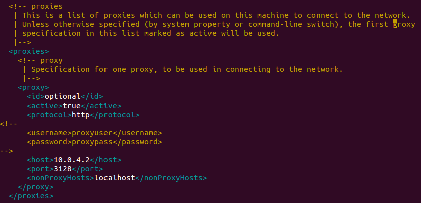
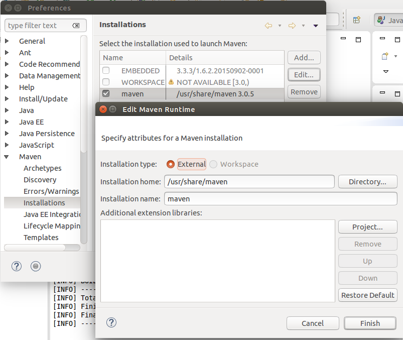
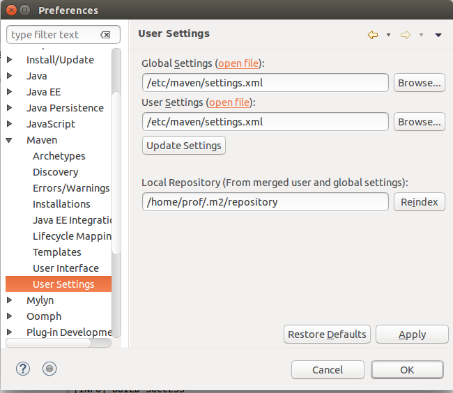
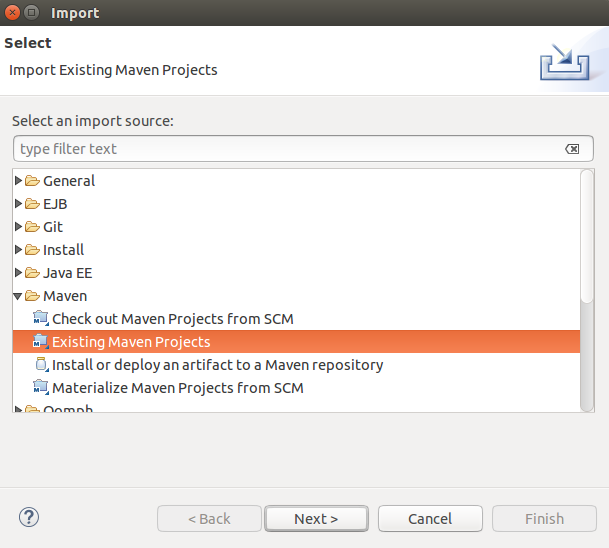

# Configuration eclipse/maven avec un proxy

ATTENTION : Cette méthode est destinée à un TP.

## Configuration du proxy

Dans le fichier /etc/maven/settings.xml, définir les lignes suivantes :




## Test de maven en ligne de commande

```
git clone https://github.com/mborne/spring-ioc-principe.git
cd spring-ioc-principe
mvn clean package
```

## Configuration d'eclipse

Voir window/preference, onglet maven

### Utilisation de maven installé dans le système



### Définition du fichier de paramètres maven



## Test dans eclipse

Via Fichier/import, on peut importer un projet maven existant :



... puis sélection du dossier contenant le pom.xml
